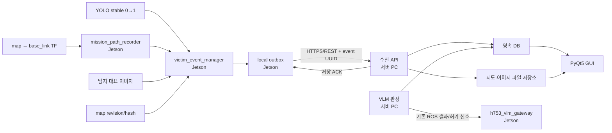

# 로봇 이동경로·YOLO 탐지 위치 DB/GUI 개발 분담 계획

기준일: 2026-08-19

## 1. 목표

하나의 구조 임무에서 로봇이 실제로 이동한 경로와 YOLO가 사람을 탐지한 순간의
로봇 위치를 서버 데이터베이스에 영구 저장하고, 서버 GUI의 지도 위에서 다음과
같이 확인할 수 있도록 한다.

- 파란 선: 임무 시작점부터 로봇이 실제로 지나온 경로
- 빨간 점: YOLO가 사람을 탐지한 순간의 로봇 위치
- 빨간 점 라벨: `사람 1`, `사람 2` 또는 운영자가 지정한 이름
- 사람 선택 시: 탐지 이미지, VLM 결과, 운영자 판정, 구호물품, 탐지 위치와
  해당 사람을 발견할 때까지의 경로 표시

첫 구현의 빨간 점은 **사람의 실제 위치가 아니라 탐지 당시 `base_link`의
`map` 좌표**다. 사람의 실제 위치는 추후 RGB-D 거리와 카메라 각도를 이용해
별도 좌표로 확장한다.

## 2. 역할 분리 원칙

| 구분 | Jetson 보드 | DB/VLM/GUI 서버 PC |
| --- | --- | --- |
| 실시간 센서·위치 | 담당 | 담당하지 않음 |
| YOLO 탐지와 즉시 정지 | 담당 | 담당하지 않음 |
| SLAM/AMCL, TF, Nav2 | 담당 | 담당하지 않음 |
| 실제 이동경로 생성 | 담당 | 수신·저장·조회 |
| 탐지 순간 로봇 위치 확정 | 담당 | 수신·저장·표시 |
| VLM 부상 상태 분석 | 영상·이벤트 전달 | 담당 |
| 데이터베이스 | 전송 실패용 로컬 outbox만 | 영속 DB 담당 |
| 지도·경로 GUI | RViz 진단만 | 운영 GUI 담당 |
| 모터·정지 해제 | 최종 안전 판단과 실행 | 직접 제어 금지 |

서버 PC는 `/cmd_vel`이나 모터 명령을 직접 발행하지 않는다. 서버의 저장 ACK,
VLM 결과 또는 운영자 명령은 Jetson의 게이트웨이와 안전 조건을 통과한 뒤에만
주행 상태에 반영한다.

## 3. 전체 구조



## 4. 공통 데이터 기준

### 4.1 식별자

- `mission_id`: 한 번의 출동·탐색 임무 UUID
- `detection_id`: 한 번의 확정된 사람 탐지 UUID
- `victim_id`: 서버가 생성하는 사람 식별자 (`victim_001` 등)
- `map_id`: 지도 YAML과 PGM 및 주요 메타데이터의 SHA-256 기반 revision
- `route_seq`: 임무 경로점의 증가 순번
- `schema_version`: 이벤트 형식 버전

모든 재전송과 DB 삽입은 `detection_id` 또는 `(mission_id, route_seq)`를
중복 방지 키로 사용한다.

### 4.2 좌표 기준

- 경로와 탐지 위치는 모두 `frame_id=map`으로 저장한다.
- 실제 위치 취득은 `/odom`이나 encoder 좌표를 직접 저장하지 않고
  TF의 `map → base_link`를 사용한다.
- 위치 데이터는 최소 `x`, `y`, `yaw`, ROS timestamp를 포함한다.
- 서버는 해당 `map_id`의 `resolution`, `origin`, 이미지 크기를 사용해
  지도 픽셀로 변환한다.
- GUI는 이벤트의 `map_id`와 표시 중인 지도의 `map_id`가 다르면 경로를
  겹쳐 그리지 않고 지도 불일치 오류를 표시한다.

### 4.3 탐지 이벤트 예시

```json
{
  "schema_version": 1,
  "mission_id": "mission_uuid",
  "detection_id": "detection_uuid",
  "detected_at": "2026-08-19T14:30:10.123+09:00",
  "map_id": "map_sha256",
  "frame_id": "map",
  "robot_pose": {
    "x": 4.21,
    "y": -1.38,
    "yaw": 1.57
  },
  "route_end_seq": 425,
  "yolo": {
    "person_found": true,
    "blue_person_found": false,
    "nearest_distance_m": 2.1
  },
  "image_id": "image_uuid"
}
```

`route_end_seq`를 저장하면 사람별로 경로 전체를 복사하지 않고도 다음과 같이
조회할 수 있다.

- 사람 1: `route_seq <= 425`
- 사람 2: `route_seq <= 810`

## 5. Jetson 보드에서 개발할 내용

### J1. 임무 상태 관리자

신규 `mission_session_manager` 또는 기존 mode manager 확장으로 임무의 시작과
종료를 관리한다.

- 임무 시작 시 `mission_id` 생성
- 현재 로봇 ID, 운용 모드, `map_id`, 시작 시각 기록
- mode 3/4 자율주행 시작과 임무 수명주기를 연결
- 임무 종료 시 마지막 `route_seq`와 종료 시각 확정
- 프로세스 재시작 시 진행 중 임무를 복구할지 새 임무를 만들지 정책화

권장사항은 모드 전환과 데이터 임무를 완전히 같은 개념으로 묶지 않는 것이다.
일시 정지나 텔레옵 인계가 발생해도 동일 임무 경로는 계속 이어져야 한다.

### J2. `mission_path_recorder` 구현

TF의 `map → base_link`를 이용해 실제 이동경로를 기록하는 ROS 2 노드를 추가한다.

- TF 확인 주기: 기본 2 Hz
- 새 경로점 추가 조건:
  - 이전 저장점에서 0.05 m 이상 이동 또는
  - yaw가 3~5도 이상 변경 또는
  - 마지막 저장 후 일정 시간이 지나 heartbeat 점이 필요할 때
- 각 점에 `mission_id`, `route_seq`, timestamp, `x`, `y`, `yaw`, `map_id` 포함
- 로컬 RViz 검증용 `/mission/path` (`nav_msgs/Path`) 발행
- TF 누락·과거 시각 lookup 실패 시 잘못된 0,0 좌표를 저장하지 않고 상태 기록
- 비정상적인 pose jump는 플래그를 남기고 서버 전송 전 검증

2 Hz로 30분 기록해도 약 3,600점이며, 거리·각도 조건을 적용하면 실제 저장량은
더 줄어든다.

### J3. `victim_event_manager` 구현

YOLO의 안정화된 사람 신호 `0→1`을 탐지 이벤트로 확정한다.

- 현재 `/yolo/person_found`, `/yolo/blue_person` 상승 신호 구독
- 탐지 시각에 해당하는 `map → base_link` pose 확보
- `detection_id` 생성
- 현재 마지막 `route_seq`를 `route_end_seq`로 고정
- `/yolo/status`의 거리·raw/stable 상태를 이벤트에 병합
- 동일 인물 재판정 방지 게이트와 연결해 잠금 중인 0→1은 새 이벤트로 만들지 않음
- 위치·시간·추적 ID 기반 중복 여부를 로컬에서 1차 검사

현재 YOLO `Int32` 메시지에는 Header가 없으므로 1차 구현에서는 수신 시각의
최신 TF를 사용할 수 있다. 정확한 시간 정합이 필요하면 장기적으로
`DetectionEvent.msg` 같은 stamped 사용자 정의 메시지를 추가한다.

### J4. 탐지 대표 이미지 저장

- `/yolo/detected_image/compressed`의 탐지 시점 전후 대표 JPEG 확보
- `detection_id`와 파일을 연결
- 연속 영상 전체가 아니라 대표 프레임 1~3장 우선 저장
- 이미지 timestamp와 탐지 timestamp 차이를 기록
- 이미지에 개인정보가 포함되므로 보관 기간과 접근 권한을 설정 가능하게 구성

### J5. 지도 revision 관리자

`map_revision_manager`를 추가하거나 임무 시작 코드에 다음 기능을 포함한다.

- 사용 중인 지도 YAML/PGM 식별
- YAML의 `resolution`, `origin`, `negate`, threshold 보존
- YAML, PGM과 메타데이터로 `map_id` 생성
- 서버에 동일 `map_id`가 없을 때만 지도 파일 업로드
- Slam Toolbox posegraph를 사용할 경우 posegraph revision도 별도 기록

### J6. 로컬 outbox와 전송 클라이언트

네트워크 장애가 데이터 유실이나 로봇 제어 실패로 이어지지 않도록 한다.

- Jetson 로컬 SQLite 또는 파일 outbox 사용
- 경로점은 1~5초 단위 batch 전송
- 탐지 이벤트와 대표 이미지는 우선 전송
- 서버 ACK 전까지 로컬 데이터 삭제 금지
- exponential backoff 재시도
- 같은 UUID로 재전송하여 서버에서 idempotent 처리
- 디스크 용량 상한, 보관 기간, 전송 완료 정리 정책 추가
- 업로드 상태 토픽 또는 진단 상태 발행

권장 전송은 서버 DB 직접 접근이 아니라 HTTPS/REST API다. ROS 2는 로봇 내부
실시간 상태와 기존 VLM 신호에 사용하고, 영속 데이터 전송은 ACK·인증·재전송을
명확하게 구현할 수 있는 API로 분리한다.

### J7. 기존 안전 계층과 통합

- 사람 최초 감지 즉시 정지는 기존 Jetson 로컬 경로 그대로 유지
- DB/API 응답을 기다린 뒤 정지하는 구조로 변경하지 않음
- 초기 통합 단계에서는 DB 저장 실패가 모터 제어에 영향을 주지 않게 분리
- 추후 운영 정책이 확정되면 `DB 저장 ACK 또는 운영자 승인`을 주행 재개 조건에
  포함하되 `h753_vlm_gateway`에서 검증
- 서버 연결이 끊겨도 기존 scan/cmd_vel/joystick/VLM stop 안전장치 유지

## 6. DB/VLM/GUI 서버 PC에서 개발할 내용

### S1. 기존 SQLite 초기화 동작 제거

현재 `rescue_logs`는 VLM 시작 시 삭제되는 구조이므로 영속 임무 DB로 사용하기
전에 반드시 수정한다.

- 실행 시 `DELETE FROM rescue_logs` 제거
- `init_db.py`를 삭제·재생성 방식에서 migration 방식으로 변경
- DB schema version 테이블 추가
- migration 전 자동 backup
- 기존 `master_manual`, `rescue_logs` 데이터 보존

초기 개발은 SQLite로 충분하다. 여러 GUI 사용자와 다중 로봇이 동시에 쓰는
단계에서 PostgreSQL 전환을 검토한다.

### S2. 데이터베이스 스키마 확장

권장 테이블은 다음과 같다.

#### `missions`

| 컬럼 | 내용 |
| --- | --- |
| `mission_id` | UUID primary key |
| `robot_id` | 로봇 식별자 |
| `map_id` | 사용 지도 FK |
| `started_at`, `ended_at` | 임무 시각 |
| `status` | ACTIVE/COMPLETED/ABORTED |

#### `maps`

| 컬럼 | 내용 |
| --- | --- |
| `map_id` | 지도 hash primary key |
| `yaml_path`, `image_path` | 서버 파일 저장 경로 |
| `resolution` | m/pixel |
| `origin_x`, `origin_y`, `origin_yaw` | ROS 지도 origin |
| `width`, `height` | 이미지 크기 |
| `checksum`, `created_at` | 무결성·생성 정보 |

#### `route_points`

| 컬럼 | 내용 |
| --- | --- |
| `mission_id`, `route_seq` | 복합 unique key |
| `stamp_ns` | 원본 ROS timestamp |
| `x`, `y`, `yaw` | `map` 좌표계 pose |
| `quality_flags` | TF/점프 검증 결과 |

`(mission_id, route_seq)`와 `(mission_id, stamp_ns)`에 index를 둔다.

#### `detections`

| 컬럼 | 내용 |
| --- | --- |
| `detection_id` | UUID, unique |
| `mission_id` | 임무 FK |
| `detected_at` | 탐지 시각 |
| `robot_x`, `robot_y`, `robot_yaw` | 빨간 점 위치 |
| `route_end_seq` | 이 사람까지 표시할 경로 끝 |
| `map_id`, `frame_id` | 좌표 기준 |
| `yolo_distance_m` | 탐지 거리 |
| `victim_id` | 서버에서 연결한 사람 FK |

#### `victims`

- `victim_id`, 화면 표시 이름, 최초 탐지 ID
- 운영자 확인 상태, 구조 우선순위, 구조 진행 상태
- 동일인 병합 여부와 병합 이력

#### `vlm_assessments`

- `detection_id`, VLM category, AI 관찰 내용, confidence
- 모델·adapter·prompt version
- VLM 원본 출력과 운영자 수정 결과를 별도 컬럼으로 보존

#### `supplies`, `images`, `audit_logs`

- 사람별 필요 구호물품과 전달 상태
- 탐지 이미지 파일 경로·checksum·timestamp
- 운영자가 판정·우선순위·구조 상태를 바꾼 이력

### S3. 이벤트 수신 API

서버만 DB를 쓰도록 API를 제공한다.

- `POST /api/v1/missions`
- `POST /api/v1/missions/{mission_id}/route-points:batch`
- `POST /api/v1/detections`
- `POST /api/v1/detections/{detection_id}/images`
- `POST /api/v1/maps`
- `GET /api/v1/missions/{mission_id}`
- `GET /api/v1/victims/{victim_id}`
- `GET /api/v1/victims/{victim_id}/route`
- `PATCH /api/v1/victims/{victim_id}`

API 요구사항:

- UUID 기반 idempotency
- schema version 검증
- 좌표계와 `map_id` 필수 검증
- 이미지·지도 checksum 확인
- DB commit 이후에만 성공 ACK 반환
- 인증 token, 요청 크기 제한, 로그 마스킹
- 잘못된 좌표나 다른 지도 revision은 DB에 정상 데이터처럼 넣지 않고 오류 반환

### S4. VLM 결과와 탐지 이벤트 연결

현재 `/vlm/result_detail` 결과에 `mission_id`, `detection_id`를 추가해 어떤 탐지의
판정인지 명확하게 연결한다.

- VLM 요청을 `detection_id`와 함께 큐에 등록
- 결과 INSERT 시 동일 `detection_id`를 FK로 저장
- VLM 원본 결과와 정제된 category 모두 저장
- `NORMAL` 오탐도 삭제하지 않고 판정 이력으로 보존
- DB 저장 성공 여부와 로봇 주행 허가 신호를 별도 상태로 관리
- 서버는 모터 명령을 직접 발행하지 않음

### S5. 지도·이미지 파일 저장소

- DB에는 큰 PGM/JPEG blob 대신 파일 경로와 checksum 저장을 우선 사용
- `maps/<map_id>/map.yaml`, `map.pgm`처럼 revision별 분리
- `missions/<mission_id>/detections/<detection_id>/` 아래 대표 이미지 저장
- 원자적 임시 파일 저장 후 rename
- DB row와 파일 중 하나만 남는 불완전 저장을 정리하는 복구 작업 추가

### S6. PyQt5 GUI 지도 화면

`QGraphicsView/QGraphicsScene` 기반 지도를 권장한다.

- `QPixmap`: PGM 지도 배경
- 파란색 `QPainterPath`: 선택한 사람까지의 실제 이동경로
- 빨간색 `QGraphicsEllipseItem`: 탐지 당시 로봇 위치
- `사람 1`, `사람 2` 라벨
- 현재 선택된 사람의 점과 경로 강조
- 지도 확대·축소·이동, 전체 경로 맞춤 보기
- 점 선택 또는 사람 목록 버튼 선택을 양방향 연동
- 오른쪽 상세 패널에 이미지, AI 관찰, 운영자 판정, 구호물품, 구조 상태 표시

ROS 좌표를 이미지 픽셀로 바꿀 때 origin yaw가 0이면 기본 변환은 다음과 같다.

```text
pixel_x = (map_x - origin_x) / resolution
pixel_y = image_height - 1 - (map_y - origin_y) / resolution
```

`origin_yaw != 0`이면 origin 회전의 역변환을 먼저 적용한다. 좌표 변환은 GUI 여러
곳에 복사하지 않고 하나의 테스트 가능한 공용 함수로 만든다.

### S7. 실시간 GUI 갱신

- 초기 화면과 과거 임무는 REST 조회
- 새 탐지·VLM 결과·구조 상태 변경은 WebSocket 또는 짧은 주기 폴링
- 연속 경로점마다 GUI 전체를 다시 그리지 않고 batch 단위 갱신
- 서버 재시작 후 DB에서 마지막 임무와 사람 목록 복원
- 데이터가 아직 업로드 중이면 `전송 중`, 실패하면 `미수신` 상태 표시

## 7. Jetson과 서버 사이의 인터페이스 책임

| 데이터 | 생성 | 최종 저장 | 비고 |
| --- | --- | --- | --- |
| `mission_id` | Jetson | 서버 | 재시작 정책 필요 |
| `map_id` | Jetson 계산 | 서버 검증 | 파일 checksum 포함 |
| 이동경로 | Jetson | 서버 `route_points` | batch + ACK |
| 탐지 UUID | Jetson | 서버 `detections` | 중복 방지 기준 |
| 탐지 당시 로봇 pose | Jetson | 서버 | `map` frame 고정 |
| 대표 이미지 | Jetson | 서버 파일 저장소 | detection UUID 연결 |
| VLM 판정 | 서버 VLM | 서버 DB | detection UUID 연결 |
| 사람 표시 이름 | 서버 | 서버 DB | 기본값 사람 1, 사람 2 |
| 운영자 수정·구조 상태 | 서버 GUI | 서버 DB | audit log 필수 |
| 즉시 정지 | Jetson | 해당 없음 | 네트워크 독립 |
| 최종 모터 출력 | Jetson | 해당 없음 | 서버 직접 제어 금지 |

## 8. 단계별 구현 순서

### Phase 1 — 데이터 계약과 로컬 시각화

Jetson:

1. `mission_id`, `detection_id`, `map_id`, timestamp 형식 확정
2. `mission_path_recorder` 구현
3. `/mission/path`를 RViz에 표시
4. YOLO 탐지 순간 pose와 `route_end_seq`를 로컬 JSON으로 저장

서버:

1. DB migration 초안 작성
2. 지도 좌표→픽셀 변환 함수와 단위 테스트 작성
3. 고정 JSON으로 GUI에 파란 경로와 빨간 점 표시

완료 기준은 서버 연결 없이 Jetson이 실제 경로와 탐지 pose를 정확히 생성하고,
같은 샘플을 GUI가 올바른 위치에 표시하는 것이다.

### Phase 2 — DB/API 연결

Jetson:

1. outbox와 batch uploader 구현
2. ACK·재시도·중복 전송 시험

서버:

1. migration 적용
2. mission/route/detection/map/image API 구현
3. DB 조회를 GUI와 연결

### Phase 3 — VLM·사람별 상세 정보 연결

Jetson:

1. 탐지 이벤트와 VLM 요청에 같은 `detection_id` 적용
2. 기존 재판정 방지 로직과 이벤트 생성 조건 통합

서버:

1. VLM 결과를 detection FK로 저장
2. 사람 1·사람 2 생성과 중복 병합 기능
3. 구호물품·운영자 판정·구조 상태 GUI 구현

### Phase 4 — 장애와 안전 검증

- 서버 미실행 상태에서 사람 감지 즉시 정지 확인
- 네트워크 단절 중 경로와 탐지 이벤트 로컬 보존
- 연결 복구 후 순서 보존 및 정확히 한 번 저장
- 서버·GUI 재시작 후 과거 임무 복원
- 잘못된 `map_id`, 손상 이미지, 중복 UUID 거부
- DB 저장 ACK와 주행 재개 정책을 최종 안전 검토 후 적용

## 9. 통합 시험 시나리오

1. Go2 정적 지도 또는 확정된 Slam Toolbox 지도에서 새 임무를 시작한다.
2. 로봇을 수동 또는 자율로 직진·회전시켜 `/mission/path`를 RViz와 비교한다.
3. 첫 장소에서 사람 1을 탐지하고 즉시 정지되는지 확인한다.
4. `detection_id`, robot pose, route end, 이미지, VLM 결과가 하나로 저장되는지 확인한다.
5. 주행을 재개하고 다른 장소에서 사람 2를 탐지한다.
6. GUI에서 사람 1 선택 시 사람 1까지의 경로와 첫 빨간 점만 강조되는지 확인한다.
7. 사람 2 선택 시 더 긴 경로와 두 번째 빨간 점이 선택되는지 확인한다.
8. 서버 네트워크를 끊은 상태에서 세 번째 시험 이벤트를 만들고 Jetson outbox를 확인한다.
9. 네트워크 복구 후 중복 없이 서버 DB에 한 번만 저장되는지 확인한다.
10. 서버와 GUI를 재시작해 모든 임무·사람·경로가 유지되는지 확인한다.

## 10. 최종 완료 기준

- GUI 경로와 RViz `map → base_link` 경로의 위치 오차가 목표 0.10 m 이내다.
- YOLO 탐지 빨간 점은 탐지 당시 로봇 pose와 일치한다.
- 가까운 시간이라도 다른 장소에서 발견한 두 사람은 별도 detection으로 저장된다.
- 같은 탐지 이벤트 재전송은 DB에 중복 INSERT되지 않는다.
- 사람 버튼을 선택하면 올바른 지도 revision, 이미지, VLM 결과, 물품과 경로가 표시된다.
- 서버 재시작 후에도 이전 임무와 경로가 유지된다.
- 네트워크 단절 중에도 Jetson의 YOLO 즉시 정지와 로봇 제어는 정상 동작한다.
- 전송 실패 데이터는 연결 복구 후 자동으로 재전송된다.
- 서버는 로봇의 원시 모터 명령을 직접 발행하지 않는다.

## 11. 후속 확장

- RGB-D의 사람 중심 거리와 카메라 optical frame을 이용해 실제 사람 위치 계산
- 빨간 점은 로봇 탐지 위치, 주황 점은 추정 사람 위치로 구분
- ByteTrack/BoT-SORT track ID와 지도 좌표를 결합한 동일인 판정
- 지나온 경로의 loop 제거와 costmap 여유 폭 검증을 통한 귀환용 안전 경로 생성
- 다중 로봇 `robot_id`와 임무 병합
- 데이터 규모가 커지면 SQLite에서 PostgreSQL/PostGIS로 이전
