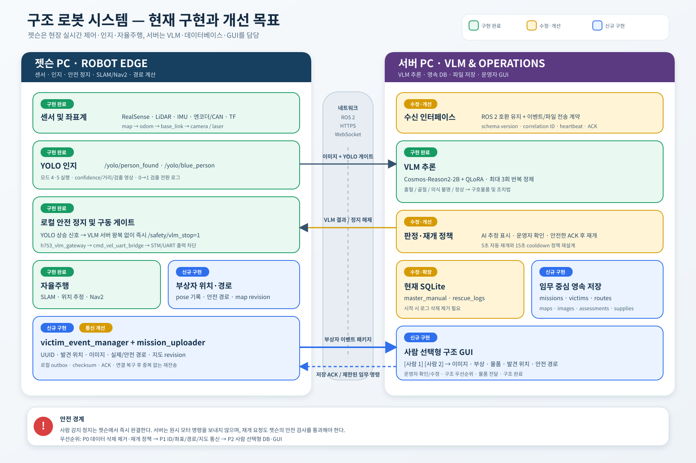

# 구조 로봇 시스템 아키텍처 — 현재 구현과 개선 목표

기준일: 2026-07-21

이 문서는 다음 두 자료를 기준으로 현재 상태와 목표 구조를 구분한다.

- 서버 VLM 문서: `/home/jyl1015/Downloads/jjproject_collaboration_guide.md`
- 젯슨 ROS 2 워크스페이스의 `h753_perception`, `h753_vlm_gateway`, `cmd_vel_uart_bridge`, SLAM/Nav2 구성

## 1. 역할 분리 원칙

### 젯슨 PC

현장에서 네트워크 지연 없이 끝나야 하는 기능을 담당한다.

- RealSense, LiDAR, IMU, 엔코더, CAN 및 TF
- YOLO 사람/파란 옷 사람 검출
- 사람 검출 시 즉시 정지 및 모터 출력 차단
- SLAM, 위치 추정, Nav2, 경로 계획과 로봇 제어
- 발견 당시 로봇 위치와 사람 위치 추정
- 실제 이동 경로 기록과 안전 경로 계산
- 지도·이미지·경로·이벤트 패키지 생성
- 서버 연결 장애 시 로컬 보관과 재전송

### 서버 PC

GPU 기반 의미 분석, 영속 저장, 운영자 인터페이스를 담당한다.

- Cosmos-Reason2-2B + QLoRA VLM 추론
- 반복 정제와 부상 분류
- 부상자·임무·구호물품·경로·지도 데이터베이스
- 발견 이미지와 지도 파일 저장
- 사람 1·사람 2 선택형 GUI
- 운영자 확인, 수정, 구조 상태 관리
- 젯슨에 저장 완료 ACK와 제한된 임무 명령 전달

서버는 모터나 `/cmd_vel`을 직접 제어하지 않는다. 서버가 보내는 결과와 명령은 젯슨의 게이트웨이와 안전 상태 검사를 통과한 뒤 적용한다.

## 2. 현재 구현 완료

### 젯슨 PC

- `h753_yolo_perception`이 `/yolo/person_found`, `/yolo/blue_person`, 검출 이미지와 상태를 발행한다.
- 모드 매니저가 모드 4·5에서 YOLO를 실행하고 검출 전환 로그를 관리한다.
- `h753_vlm_gateway`는 모드 3·4·5에서 VLM 통신을 허용한다.
- YOLO 0→1 상승 신호를 받으면 서버 응답을 기다리지 않고 `/safety/vlm_stop=1`을 즉시 래치한다.
- `cmd_vel_uart_bridge`는 정지 래치가 활성화된 동안 STM/UART 구동 명령을 차단한다.
- 서버의 명시적인 `/vlm/injury_stop=0`을 받기 전까지 정지 상태를 유지한다.
- 카메라 압축 영상을 `/vlm/request/image/compressed`로 전달할 수 있다.
- `/vlm/result`, `/vlm/result_detail`, `/vlm/injury_stop`과 호환되는 게이트웨이가 구현되어 있다.
- LiDAR SLAM, Nav2, 엔코더·IMU 오도메트리와 모드별 실행 구조가 존재한다.

### 서버 PC

- `vlm.py`가 카메라 영상과 indoor/outdoor YOLO 게이트를 구독한다.
- `nvidia/Cosmos-Reason2-2B`와 QLoRA 어댑터를 사용한다.
- 최대 3회의 반복 정제를 거쳐 `BLEEDING`, `FRACTURE`, `UNCONSCIOUS`, `NORMAL`을 분류한다.
- 분류 결과를 지혈대, 부목·압박붕대, AED와 매핑한다.
- `/vlm/result`, `/vlm/injury_stop`, `/vlm/result_detail`을 발행한다.
- SQLite의 `master_manual`, `rescue_logs`를 사용한다.
- PyQt5 대시보드가 카메라, VLM 결과, 로그와 물품 집계를 표시한다.

## 3. 기존 기능에서 수정·개선할 사항

### P0 — 데이터 유실과 안전 동작

1. `vlm.py` 시작 시 `rescue_logs`를 삭제하는 동작을 제거한다.
2. 서버 VLM의 5초 정지 유지 후 자동 재주행을 임무 정책으로 분리한다.
3. 단순 15초 cooldown을 위치·track ID·detection UUID 기반 중복 판정으로 교체한다.
4. 서버 무응답 시 정지 해제 여부와 운영자 수동 재개 절차를 명확히 정의한다.
5. `/vlm/injury_stop=0`은 DB·이미지·위치 저장 완료 ACK 또는 운영자 승인 후에만 허용한다.

### P1 — 통신 계약

1. VLM 서버의 카메라 입력을 원본 카메라 토픽 직접 구독에서 `/vlm/request/image/compressed`로 통일한다.
2. `std_msgs/String` JSON에 `mission_id`, `detection_id`, `victim_id`, 좌표계, 지도 revision과 schema version을 추가한다.
3. 장기적으로 문자열 JSON 대신 사용자 정의 ROS 메시지 또는 HTTPS API를 사용한다.
4. 서버 heartbeat와 요청/응답 correlation ID를 추가한다.
5. 이미지·지도·경로 전송에는 checksum, 중복 방지, ACK와 재전송을 적용한다.
6. 연속 고화질 영상 대신 감지 전후 대표 프레임을 우선 전송하고, GUI 미리보기는 별도 저속 스트림으로 분리한다.

### P1 — VLM과 데이터

1. VLM 결과를 의료 진단이 아닌 `AI 관찰/추정`으로 저장하고 운영자 확인 필드를 둔다.
2. 현재 하드코딩 경로를 설정 파일이나 환경 변수로 이동한다.
3. `vlm.py`, 테스트, 데이터 생성 스크립트의 프롬프트를 단일 공용 파일로 통합한다.
4. 모델 버전, 어댑터 버전, 프롬프트 버전과 추론 confidence를 결과에 기록한다.
5. VLM 원본 출력과 운영자 수정 결과를 별도로 보존한다.

### P2 — GUI

1. 단일 로그 목록을 임무별 부상자 목록으로 변경한다.
2. 사람 이름을 선택하면 해당 사람의 이미지, AI 판정, 운영자 판정, 구호물품, 발견 위치와 경로를 함께 표시한다.
3. 지도 revision이 다른 경로를 잘못 겹치지 않도록 검증한다.
4. 구조 우선순위, 확인 상태, 물품 전달, 구조 완료 상태를 수정할 수 있게 한다.

## 4. 신규 구현이 필요한 기능

### 젯슨 PC

- `victim_event_manager`: detection UUID 생성, 연속 검출 확정, 중복 인물 판정
- `victim_localizer`: `map` 기준 로봇 관측 위치와 가능한 경우 실제 사람 위치 계산
- `mission_path_recorder`: `map → base_link` 기반 실제 이동 경로 누적
- `safe_route_generator`: 경로 단순화, loop 제거, 지도·여유 폭 충돌 검사
- `map_revision_manager`: 지도 스냅샷과 posegraph revision 연결
- `mission_uploader`: 이미지·지도·경로·메타데이터 전송, 로컬 outbox와 재전송
- `mission_command_guard`: 서버 명령을 검증하고 안전할 때만 주행 재개

### 서버 PC

- `missions`, `victims`, `detections`, `vlm_assessments`, `supplies`, `routes`, `maps`, `images` 스키마
- SQLite 초기화 방식 제거와 영속 DB 마이그레이션
- 이미지·지도·경로 파일 저장소
- 이벤트 수신 API와 업로드 ACK
- 사람별 상세 정보와 지도 경로를 제공하는 GUI 백엔드
- 새로운 부상자와 상태 변경을 알리는 WebSocket
- 운영자 판정, 구조 우선순위와 물품 상태 변경 이력

## 5. 부상자 2명 발견 시 목표 시퀀스

1. 젯슨 YOLO가 첫 번째 사람을 확정하고 로컬 안전 정지를 즉시 래치한다.
2. 젯슨은 `detection UUID + 대표 이미지 + map 좌표 + 지도 revision + 실제 경로`를 묶는다.
3. 서버 VLM이 부상 유형과 구호물품을 분석한다.
4. 서버가 `victim_001 / 사람 1`을 생성하고 저장 완료 ACK를 보낸다.
5. 젯슨이 안전 조건 및 임무 정책을 확인한 뒤 주행을 재개한다.
6. 다른 위치에서 두 번째 사람을 검출하면 새로운 UUID로 동일한 절차를 수행한다.
7. 서버는 위치와 추적 정보를 확인한 뒤 `victim_002 / 사람 2`를 생성한다.
8. GUI에서 사람 1 또는 사람 2를 선택하면 해당 사람의 정보와 출발지부터의 안전 경로만 강조한다.

## 6. 완료 기준

- 서버를 재시작해도 이전 임무와 부상자 데이터가 유지된다.
- 동일 인물의 반복 프레임이 여러 사람으로 등록되지 않는다.
- 가까운 시간에 다른 장소에서 검출된 두 사람은 별도 레코드로 저장된다.
- 네트워크가 끊겨도 젯슨의 사람 감지 정지는 즉시 동작한다.
- 전송 실패 데이터는 연결 복구 후 중복 없이 재전송된다.
- 사람 버튼 선택 시 올바른 지도 revision, 발견 위치, 이미지, VLM 결과와 안전 경로가 표시된다.
- 서버는 로봇의 원시 모터 명령을 직접 발행하지 않는다.
