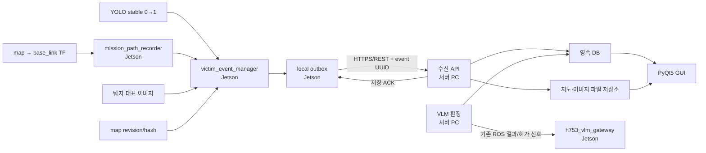

# 로봇 이동경로·YOLO 탐지 위치 DB/GUI 개발 분담 계획

> 문서 상태: 장기 계획 및 이전 논의 기록. 2026-09-07 현재 서버 PC에 전달할
> 최신 1차 작업 범위는 `SERVER_PC_DB_VLM_GUI_DEVELOPMENT_REQUEST_20260907.md`를
> 우선한다. 특히 실제 사람 좌표, 최적 안전 귀환경로, 서버 단절 복구,
> `/vlm/decision` 기반 엄격한 해제는 현재 범위가 아니다.

최초 계획 기준일: 2026-08-19
서버 S1~S6 체크리스트 기준일: 2026-08-19
Jetson 통합 검토 및 최종 갱신일: 2026-09-07

문서 관리 위치: `md/`

## 0. 날짜별 변경 비교

| 날짜 | 구분 | 당시 상태 | 이후 달라진 내용 |
| --- | --- | --- | --- |
| 2026-08-19 | 최초 공동 계획 | Jetson J1~J7과 서버 S1~S7을 구현 대상으로 정의 | 역할·ID·DB·API·GUI·통합시험 기준 수립 |
| 2026-08-19 | 서버 체크리스트 | 서버 S1/S2/S3/S5 완료 보고, S4/S6 부분 구현, Jetson은 미착수로 인식 | 서버 단독 구현 결과와 실제 Go2 지도 업로드 결과 전달 |
| 2026-08-19 | Jetson 1차 구현 | J1~J6과 기존 안전 계층 연동, 로컬 outbox 및 uploader 구현 | 체크리스트의 Jetson 미착수 정보가 더 이상 현재 상태와 맞지 않음 |
| 2026-09-04 | 통합 계약 검토 | 양쪽 구현을 처음 대조 | map ID·지도 endpoint·인증·outbox 상태 차이를 확인하고 Jetson 보정 |
| 2026-09-04 | 현재 전달본 | Jetson 자동시험 `125 passed`, 서버 최신 소스 대기 | 13절 답변 양식과 14절 통합·후속 작업을 추가 |
| 2026-09-07 | 실제 서버 HEAD 대조 | `jjproject_10_260904` / `461f9045...` 기준 API 계약 확인 | multipart·오류 격리·임무 종료·VLM decision 검증 경로 구현, `138 passed` |

서버 담당자는 `2026-08-19 최초 계획`만 기준으로 판단하지 않고
`2026-09-04 현재 전달본`의 12~14절을 함께 확인해야 한다. 다음 회신에도
작성일, 적용 commit과 이전 체크리스트 이후의 변경점을 반드시 기록한다.

### 0.1 현재 확정 범위 단순화 (2026-09-07)

현재 1차 완료 범위는 다음 세 가지로 제한한다.

1. 로봇이 실제 지나온 `map` 기준 경로를 저장하고 GUI에 표시
2. YOLO가 사람을 탐지한 당시의 로봇 `x, y, yaw`를 빨간 점으로 표시
3. 기존 VLM 판단이 끝난 뒤 `/vlm/injury_stop=0`으로 주행 재개

다음 기능은 현재 개발·완료 기준에서 제외한다. 아래 과거 절에 관련 내용이
남아 있더라도 후속 아이디어 기록일 뿐 현재 요구사항이 아니다.

- RGB-D를 이용한 사람 자체의 지도 좌표 계산
- 최적 안전 귀환 경로 생성
- 서버 단절 후 자동 복구와 장애 복구 시험
- detection ID 기반 엄격한 주행 해제
- 장기 동일인 추적·자동 병합

## 1. 목표

하나의 구조 임무에서 로봇이 실제로 이동한 경로와 YOLO가 사람을 탐지한 순간의
로봇 위치를 서버 데이터베이스에 영구 저장하고, 서버 GUI의 지도 위에서 다음과
같이 확인할 수 있도록 한다.

- 파란 선: 임무 시작점부터 로봇이 실제로 지나온 경로
- 빨간 점: YOLO가 사람을 탐지한 순간의 로봇 위치
- 빨간 점 라벨: `사람 1`, `사람 2` 또는 운영자가 지정한 이름
- 사람 선택 시: 탐지 이미지, VLM 결과, 운영자 판정, 구호물품, 탐지 위치와
  해당 사람을 발견할 때까지의 경로 표시

첫 구현의 빨간 점은 **사람의 실제 위치가 아니라 탐지 당시 `base_link`의
`map` 좌표**다. 사람의 실제 위치는 추후 RGB-D 거리와 카메라 각도를 이용해
별도 좌표로 확장한다.

## 2. 역할 분리 원칙

| 구분 | Jetson 보드 | DB/VLM/GUI 서버 PC |
| --- | --- | --- |
| 실시간 센서·위치 | 담당 | 담당하지 않음 |
| YOLO 탐지와 즉시 정지 | 담당 | 담당하지 않음 |
| SLAM/AMCL, TF, Nav2 | 담당 | 담당하지 않음 |
| 실제 이동경로 생성 | 담당 | 수신·저장·조회 |
| 탐지 순간 로봇 위치 확정 | 담당 | 수신·저장·표시 |
| VLM 부상 상태 분석 | 영상·이벤트 전달 | 담당 |
| 데이터베이스 | 전송 실패용 로컬 outbox만 | 영속 DB 담당 |
| 지도·경로 GUI | RViz 진단만 | 운영 GUI 담당 |
| 모터·정지 해제 | 최종 안전 판단과 실행 | 직접 제어 금지 |

서버 PC는 `/cmd_vel`이나 모터 명령을 직접 발행하지 않는다. 서버의 저장 ACK,
VLM 결과 또는 운영자 명령은 Jetson의 게이트웨이와 안전 조건을 통과한 뒤에만
주행 상태에 반영한다.

## 3. 전체 구조



## 4. 공통 데이터 기준

### 4.1 식별자

- `mission_id`: 한 번의 출동·탐색 임무 UUID
- `detection_id`: 한 번의 확정된 사람 탐지 UUID
- `victim_id`: 서버가 생성하는 사람 식별자 (`victim_001` 등)
- `map_id`: 지도 YAML과 PGM 및 주요 메타데이터의 SHA-256 기반 revision
- `route_seq`: 임무 경로점의 증가 순번
- `schema_version`: 이벤트 형식 버전

모든 재전송과 DB 삽입은 `detection_id` 또는 `(mission_id, route_seq)`를
중복 방지 키로 사용한다.

### 4.2 좌표 기준

- 경로와 탐지 위치는 모두 `frame_id=map`으로 저장한다.
- 실제 위치 취득은 `/odom`이나 encoder 좌표를 직접 저장하지 않고
  TF의 `map → base_link`를 사용한다.
- 위치 데이터는 최소 `x`, `y`, `yaw`, ROS timestamp를 포함한다.
- 서버는 해당 `map_id`의 `resolution`, `origin`, 이미지 크기를 사용해
  지도 픽셀로 변환한다.
- GUI는 이벤트의 `map_id`와 표시 중인 지도의 `map_id`가 다르면 경로를
  겹쳐 그리지 않고 지도 불일치 오류를 표시한다.

### 4.3 탐지 이벤트 예시

```json
{
  "schema_version": 1,
  "mission_id": "mission_uuid",
  "detection_id": "detection_uuid",
  "detected_at": "2026-08-19T14:30:10.123+09:00",
  "map_id": "map_sha256",
  "frame_id": "map",
  "robot_pose": {
    "x": 4.21,
    "y": -1.38,
    "yaw": 1.57
  },
  "route_end_seq": 425,
  "yolo": {
    "person_found": true,
    "blue_person_found": false,
    "nearest_distance_m": 2.1
  },
  "image_id": "image_uuid"
}
```

`route_end_seq`를 저장하면 사람별로 경로 전체를 복사하지 않고도 다음과 같이
조회할 수 있다.

- 사람 1: `route_seq <= 425`
- 사람 2: `route_seq <= 810`

## 5. Jetson 보드에서 개발할 내용

### J1. 임무 상태 관리자

신규 `mission_session_manager` 또는 기존 mode manager 확장으로 임무의 시작과
종료를 관리한다.

- 임무 시작 시 `mission_id` 생성
- 현재 로봇 ID, 운용 모드, `map_id`, 시작 시각 기록
- mode 3/4 자율주행 시작과 임무 수명주기를 연결
- 임무 종료 시 마지막 `route_seq`와 종료 시각 확정
- 프로세스 재시작 시 진행 중 임무를 복구할지 새 임무를 만들지 정책화

권장사항은 모드 전환과 데이터 임무를 완전히 같은 개념으로 묶지 않는 것이다.
일시 정지나 텔레옵 인계가 발생해도 동일 임무 경로는 계속 이어져야 한다.

### J2. `mission_path_recorder` 구현

TF의 `map → base_link`를 이용해 실제 이동경로를 기록하는 ROS 2 노드를 추가한다.

- TF 확인 주기: 기본 2 Hz
- 새 경로점 추가 조건:
  - 이전 저장점에서 0.05 m 이상 이동 또는
  - yaw가 3~5도 이상 변경 또는
  - 마지막 저장 후 일정 시간이 지나 heartbeat 점이 필요할 때
- 각 점에 `mission_id`, `route_seq`, timestamp, `x`, `y`, `yaw`, `map_id` 포함
- 로컬 RViz 검증용 `/mission/path` (`nav_msgs/Path`) 발행
- TF 누락·과거 시각 lookup 실패 시 잘못된 0,0 좌표를 저장하지 않고 상태 기록
- 비정상적인 pose jump는 플래그를 남기고 서버 전송 전 검증

2 Hz로 30분 기록해도 약 3,600점이며, 거리·각도 조건을 적용하면 실제 저장량은
더 줄어든다.

### J3. `victim_event_manager` 구현

YOLO의 안정화된 사람 신호 `0→1`을 탐지 이벤트로 확정한다.

- 현재 `/yolo/person_found`, `/yolo/blue_person` 상승 신호 구독
- 탐지 시각에 해당하는 `map → base_link` pose 확보
- `detection_id` 생성
- 현재 마지막 `route_seq`를 `route_end_seq`로 고정
- `/yolo/status`의 거리·raw/stable 상태를 이벤트에 병합
- 동일 인물 재판정 방지 게이트와 연결해 잠금 중인 0→1은 새 이벤트로 만들지 않음
- 위치·시간·추적 ID 기반 중복 여부를 로컬에서 1차 검사

현재 YOLO `Int32` 메시지에는 Header가 없으므로 1차 구현에서는 수신 시각의
최신 TF를 사용할 수 있다. 정확한 시간 정합이 필요하면 장기적으로
`DetectionEvent.msg` 같은 stamped 사용자 정의 메시지를 추가한다.

### J4. 탐지 대표 이미지 저장

- `/yolo/detected_image/compressed`의 탐지 시점 전후 대표 JPEG 확보
- `detection_id`와 파일을 연결
- 연속 영상 전체가 아니라 대표 프레임 1~3장 우선 저장
- 이미지 timestamp와 탐지 timestamp 차이를 기록
- 이미지에 개인정보가 포함되므로 보관 기간과 접근 권한을 설정 가능하게 구성

### J5. 지도 revision 관리자

`map_revision_manager`를 추가하거나 임무 시작 코드에 다음 기능을 포함한다.

- 사용 중인 지도 YAML/PGM 식별
- YAML의 `resolution`, `origin`, `negate`, threshold 보존
- YAML, PGM과 메타데이터로 `map_id` 생성
- 서버에 동일 `map_id`가 없을 때만 지도 파일 업로드
- Slam Toolbox posegraph를 사용할 경우 posegraph revision도 별도 기록

### J6. 로컬 outbox와 전송 클라이언트

네트워크 장애가 데이터 유실이나 로봇 제어 실패로 이어지지 않도록 한다.

- Jetson 로컬 SQLite 또는 파일 outbox 사용
- 경로점은 1~5초 단위 batch 전송
- 탐지 이벤트와 대표 이미지는 우선 전송
- 서버 ACK 전까지 로컬 데이터 삭제 금지
- exponential backoff 재시도
- 같은 UUID로 재전송하여 서버에서 idempotent 처리
- 디스크 용량 상한, 보관 기간, 전송 완료 정리 정책 추가
- 업로드 상태 토픽 또는 진단 상태 발행

#### 전송 상태와 서버 수신 확인

로컬 outbox의 각 전송 항목은 다음 상태로 관리한다.

- `PENDING`: 아직 서버의 저장 완료 응답을 받지 못한 항목
- `SENT`: 서버가 DB commit을 완료한 뒤 HTTP `2xx` ACK를 반환한 항목
- `FAILED`: 전송 오류가 발생하여 재시도 시각과 오류 내용을 기록한 항목

uploader는 `PENDING`과 재시도 시각이 된 `FAILED` 항목만 전송한다. 네트워크
단절, timeout 또는 HTTP 오류가 발생하면 데이터를 삭제하지 않고 `FAILED`로
남긴 뒤 exponential backoff를 적용한다. 서버의 HTTP `2xx` 응답을 받은 경우에만
`SENT`로 전환한다.

서버가 저장을 완료했지만 ACK가 Jetson에 도착하지 않는 경우도 고려한다. 이때
Jetson은 같은 UUID와 `Idempotency-Key`로 재전송하고, 서버는 기존 레코드를
조회하여 중복 INSERT 없이 성공 ACK를 다시 반환해야 한다.

권장 전송은 서버 DB 직접 접근이 아니라 HTTPS/REST API다. ROS 2는 로봇 내부
실시간 상태와 기존 VLM 신호에 사용하고, 영속 데이터 전송은 ACK·인증·재전송을
명확하게 구현할 수 있는 API로 분리한다.

### J7. 기존 안전 계층과 통합

- 사람 최초 감지 즉시 정지는 기존 Jetson 로컬 경로 그대로 유지
- DB/API 응답을 기다린 뒤 정지하는 구조로 변경하지 않음
- 초기 통합 단계에서는 DB 저장 실패가 모터 제어에 영향을 주지 않게 분리
- 추후 운영 정책이 확정되면 `DB 저장 ACK 또는 운영자 승인`을 주행 재개 조건에
  포함하되 `h753_vlm_gateway`에서 검증
- 서버 연결이 끊겨도 기존 scan/cmd_vel/joystick/VLM stop 안전장치 유지

## 6. DB/VLM/GUI 서버 PC에서 개발할 내용

### S1. 기존 SQLite 초기화 동작 제거

현재 `rescue_logs`는 VLM 시작 시 삭제되는 구조이므로 영속 임무 DB로 사용하기
전에 반드시 수정한다.

- 실행 시 `DELETE FROM rescue_logs` 제거
- `init_db.py`를 삭제·재생성 방식에서 migration 방식으로 변경
- DB schema version 테이블 추가
- migration 전 자동 backup
- 기존 `master_manual`, `rescue_logs` 데이터 보존

초기 개발은 SQLite로 충분하다. 여러 GUI 사용자와 다중 로봇이 동시에 쓰는
단계에서 PostgreSQL 전환을 검토한다.

### S2. 데이터베이스 스키마 확장

권장 테이블은 다음과 같다.

#### `missions`

| 컬럼 | 내용 |
| --- | --- |
| `mission_id` | UUID primary key |
| `robot_id` | 로봇 식별자 |
| `map_id` | 사용 지도 FK |
| `started_at`, `ended_at` | 임무 시각 |
| `status` | ACTIVE/COMPLETED/ABORTED |

#### `maps`

| 컬럼 | 내용 |
| --- | --- |
| `map_id` | 지도 hash primary key |
| `yaml_path`, `image_path` | 서버 파일 저장 경로 |
| `resolution` | m/pixel |
| `origin_x`, `origin_y`, `origin_yaw` | ROS 지도 origin |
| `width`, `height` | 이미지 크기 |
| `checksum`, `created_at` | 무결성·생성 정보 |

#### `route_points`

| 컬럼 | 내용 |
| --- | --- |
| `mission_id`, `route_seq` | 복합 unique key |
| `stamp_ns` | 원본 ROS timestamp |
| `x`, `y`, `yaw` | `map` 좌표계 pose |
| `quality_flags` | TF/점프 검증 결과 |

`(mission_id, route_seq)`와 `(mission_id, stamp_ns)`에 index를 둔다.

#### `detections`

| 컬럼 | 내용 |
| --- | --- |
| `detection_id` | UUID, unique |
| `mission_id` | 임무 FK |
| `detected_at` | 탐지 시각 |
| `robot_x`, `robot_y`, `robot_yaw` | 빨간 점 위치 |
| `route_end_seq` | 이 사람까지 표시할 경로 끝 |
| `map_id`, `frame_id` | 좌표 기준 |
| `yolo_distance_m` | 탐지 거리 |
| `victim_id` | 서버에서 연결한 사람 FK |

#### `victims`

- `victim_id`, 화면 표시 이름, 최초 탐지 ID
- 운영자 확인 상태, 구조 우선순위, 구조 진행 상태
- 동일인 병합 여부와 병합 이력

#### `vlm_assessments`

- `detection_id`, VLM category, AI 관찰 내용, confidence
- 모델·adapter·prompt version
- VLM 원본 출력과 운영자 수정 결과를 별도 컬럼으로 보존

#### `supplies`, `images`, `audit_logs`

- 사람별 필요 구호물품과 전달 상태
- 탐지 이미지 파일 경로·checksum·timestamp
- 운영자가 판정·우선순위·구조 상태를 바꾼 이력

### S3. 이벤트 수신 API

서버만 DB를 쓰도록 API를 제공한다.

- `POST /api/v1/missions`
- `POST /api/v1/missions/{mission_id}/route-points:batch`
- `POST /api/v1/detections`
- `POST /api/v1/detections/{detection_id}/images`
- `POST /api/v1/maps`
- `POST /api/v1/maps:upload` (YAML/PGM 실제 파일 업로드)
- `GET /api/v1/missions/{mission_id}`
- `GET /api/v1/victims/{victim_id}`
- `GET /api/v1/victims/{victim_id}/route`
- `PATCH /api/v1/victims/{victim_id}`

API 요구사항:

- UUID 기반 idempotency
- 서버 DB 전체나 기존 임무 데이터를 파일처럼 덮어쓰지 않음
- `mission_id`, `detection_id`, `image_id`, `map_id` 및
  `(mission_id, route_seq)` 고유 키를 기준으로 INSERT 또는 제한된 UPSERT 수행
- 같은 idempotency key와 동일 payload의 재요청은 중복 생성 없이 기존 저장
  결과를 성공으로 반환
- 같은 idempotency key에 서로 다른 payload가 들어오면 충돌 오류로 거부
- schema version 검증
- 좌표계와 `map_id` 필수 검증
- 이미지·지도 checksum 확인
- DB commit 이후에만 성공 ACK 반환
- `X-API-Key` 인증, 요청 크기 제한, 로그 마스킹
- 잘못된 좌표나 다른 지도 revision은 DB에 정상 데이터처럼 넣지 않고 오류 반환

### S4. VLM 결과와 탐지 이벤트 연결

현재 `/vlm/result_detail` 결과에 `mission_id`, `detection_id`를 추가해 어떤 탐지의
판정인지 명확하게 연결한다.

- VLM 요청을 `detection_id`와 함께 큐에 등록
- 결과 INSERT 시 동일 `detection_id`를 FK로 저장
- VLM 원본 결과와 정제된 category 모두 저장
- `NORMAL` 오탐도 삭제하지 않고 판정 이력으로 보존
- DB 저장 성공 여부와 로봇 주행 허가 신호를 별도 상태로 관리
- 서버는 모터 명령을 직접 발행하지 않음

### S5. 지도·이미지 파일 저장소

- DB에는 큰 PGM/JPEG blob 대신 파일 경로와 checksum 저장을 우선 사용
- `maps/<map_id>/map.yaml`, `map.pgm`처럼 revision별 분리
- `missions/<mission_id>/detections/<detection_id>/` 아래 대표 이미지 저장
- 원자적 임시 파일 저장 후 rename
- DB row와 파일 중 하나만 남는 불완전 저장을 정리하는 복구 작업 추가

### S6. PyQt5 GUI 지도 화면

`QGraphicsView/QGraphicsScene` 기반 지도를 권장한다.

- `QPixmap`: PGM 지도 배경
- 파란색 `QPainterPath`: 선택한 사람까지의 실제 이동경로
- 빨간색 `QGraphicsEllipseItem`: 탐지 당시 로봇 위치
- `사람 1`, `사람 2` 라벨
- 현재 선택된 사람의 점과 경로 강조
- 지도 확대·축소·이동, 전체 경로 맞춤 보기
- 점 선택 또는 사람 목록 버튼 선택을 양방향 연동
- 오른쪽 상세 패널에 이미지, AI 관찰, 운영자 판정, 구호물품, 구조 상태 표시

ROS 좌표를 이미지 픽셀로 바꿀 때 origin yaw가 0이면 기본 변환은 다음과 같다.

```text
pixel_x = (map_x - origin_x) / resolution
pixel_y = image_height - 1 - (map_y - origin_y) / resolution
```

`origin_yaw != 0`이면 origin 회전의 역변환을 먼저 적용한다. 좌표 변환은 GUI 여러
곳에 복사하지 않고 하나의 테스트 가능한 공용 함수로 만든다.

### S7. 실시간 GUI 갱신

- 초기 화면과 과거 임무는 REST 조회
- 새 탐지·VLM 결과·구조 상태 변경은 WebSocket 또는 짧은 주기 폴링
- 연속 경로점마다 GUI 전체를 다시 그리지 않고 batch 단위 갱신
- 서버 재시작 후 DB에서 마지막 임무와 사람 목록 복원
- 데이터가 아직 업로드 중이면 `전송 중`, 실패하면 `미수신` 상태 표시

## 7. Jetson과 서버 사이의 인터페이스 책임

| 데이터 | 생성 | 최종 저장 | 비고 |
| --- | --- | --- | --- |
| `mission_id` | Jetson | 서버 | 재시작 정책 필요 |
| `map_id` | Jetson 계산 | 서버 검증 | 파일 checksum 포함 |
| 이동경로 | Jetson | 서버 `route_points` | batch + ACK |
| 탐지 UUID | Jetson | 서버 `detections` | 중복 방지 기준 |
| 탐지 당시 로봇 pose | Jetson | 서버 | `map` frame 고정 |
| 대표 이미지 | Jetson | 서버 파일 저장소 | detection UUID 연결 |
| VLM 판정 | 서버 VLM | 서버 DB | detection UUID 연결 |
| 사람 표시 이름 | 서버 | 서버 DB | 기본값 사람 1, 사람 2 |
| 운영자 수정·구조 상태 | 서버 GUI | 서버 DB | audit log 필수 |
| 즉시 정지 | Jetson | 해당 없음 | 네트워크 독립 |
| 최종 모터 출력 | Jetson | 해당 없음 | 서버 직접 제어 금지 |

## 8. 단계별 구현 순서

### Phase 1 — 데이터 계약과 로컬 시각화

Jetson:

1. `mission_id`, `detection_id`, `map_id`, timestamp 형식 확정
2. `mission_path_recorder` 구현
3. `/mission/path`를 RViz에 표시
4. YOLO 탐지 순간 pose와 `route_end_seq`를 로컬 JSON으로 저장

서버:

1. DB migration 초안 작성
2. 지도 좌표→픽셀 변환 함수와 단위 테스트 작성
3. 고정 JSON으로 GUI에 파란 경로와 빨간 점 표시

완료 기준은 서버 연결 없이 Jetson이 실제 경로와 탐지 pose를 정확히 생성하고,
같은 샘플을 GUI가 올바른 위치에 표시하는 것이다.

### Phase 2 — DB/API 연결

Jetson:

1. outbox와 batch uploader 구현
2. ACK·재시도·중복 전송 시험

서버:

1. migration 적용
2. mission/route/detection/map/image API 구현
3. DB 조회를 GUI와 연결

### Phase 3 — VLM·사람별 상세 정보 연결

Jetson:

1. 탐지 이벤트와 VLM 요청에 같은 `detection_id` 적용
2. 기존 재판정 방지 로직과 이벤트 생성 조건 통합

서버:

1. VLM 결과를 detection FK로 저장
2. 사람 1·사람 2 생성과 중복 병합 기능
3. 구호물품·운영자 판정·구조 상태 GUI 구현

### Phase 4 — 기본 안전 검증

- 서버 미실행 상태에서 사람 감지 즉시 정지 확인
- 잘못된 `map_id`, 손상 이미지, 중복 UUID 거부
- 기존 VLM 판단 완료 후 `/vlm/injury_stop=0` 주행 재개 확인

## 9. 통합 시험 시나리오

1. Go2 정적 지도 또는 확정된 Slam Toolbox 지도에서 새 임무를 시작한다.
2. 로봇을 수동 또는 자율로 직진·회전시켜 `/mission/path`를 RViz와 비교한다.
3. 첫 장소에서 사람 1을 탐지하고 즉시 정지되는지 확인한다.
4. `detection_id`, robot pose, route end, 이미지, VLM 결과가 하나로 저장되는지 확인한다.
5. 주행을 재개하고 다른 장소에서 사람 2를 탐지한다.
6. GUI에서 사람 1 선택 시 사람 1까지의 경로와 첫 빨간 점만 강조되는지 확인한다.
7. 사람 2 선택 시 더 긴 경로와 두 번째 빨간 점이 선택되는지 확인한다.
8. VLM 판단 완료 후 기존 `/vlm/injury_stop=0`으로 주행이 재개되는지 확인한다.

## 10. 최종 완료 기준

- GUI 경로와 RViz `map → base_link` 경로의 위치 오차가 목표 0.10 m 이내다.
- YOLO 탐지 빨간 점은 탐지 당시 로봇 pose와 일치한다.
- 가까운 시간이라도 다른 장소에서 발견한 두 사람은 별도 detection으로 저장된다.
- 같은 탐지 이벤트 재전송은 DB에 중복 INSERT되지 않는다.
- 사람 버튼을 선택하면 올바른 지도 revision, 이미지, VLM 결과, 물품과 경로가 표시된다.
- 서버는 로봇의 원시 모터 명령을 직접 발행하지 않는다.

## 11. 후속 확장

- RGB-D의 사람 중심 거리와 카메라 optical frame을 이용해 실제 사람 위치 계산
- 빨간 점은 로봇 탐지 위치, 주황 점은 추정 사람 위치로 구분
- ByteTrack/BoT-SORT track ID와 지도 좌표를 결합한 동일인 판정
- 지나온 경로의 loop 제거와 costmap 여유 폭 검증을 통한 귀환용 안전 경로 생성
- 다중 로봇 `robot_id`와 임무 병합
- 데이터 규모가 커지면 SQLite에서 PostgreSQL/PostGIS로 이전

## 12. Jetson 구현 현황 (2026-08-19)

### 구현 완료

- 통합 프로세스 `h753_mission_data_recorder`로 J1~J5 구현
- `mission_id`, `detection_id`, `image_id`, `map_id`, `route_seq` 계약 적용
- TF `map → base_link` 기반 2 Hz 실제 경로 기록
- 거리·회전·heartbeat 샘플링과 localization jump segment 분리
- YOLO/VLM gateway 재무장 상태와 연결한 1 cycle 1 detection 생성
- 탐지 순간 pose 강제 기록 및 `route_end_seq` 고정
- stale 이미지 보호가 있는 탐지 대표 이미지 로컬 저장
- SQLite WAL 기반 `missions/route_points/detections/outbox` 영속 저장
- 프로세스 재시작 시 같은 map의 ACTIVE 임무 복구
- `/mission/path`, `/mission/status`, `/mission/detection_event` 발행
- `/mission/start_new`, `/mission/end` 서비스
- RViz navigation 화면에 파란 실제 이동경로 표시
- `h753_mission_uploader`의 HTTPS, token 환경 변수, idempotency key, batch,
  ACK 후 완료 처리와 exponential backoff 구현
- outbox는 서버 ACK 전 `PENDING/FAILED`를 유지하고, DB 저장 완료를 의미하는
  HTTP `2xx` ACK를 받은 항목만 `SENT`로 전환
- 서버에는 전체 DB 덮어쓰기가 아니라 UUID·경로 순번을 기준으로 추가/갱신하며,
  ACK 유실 후 재전송도 중복 없이 처리하도록 API 계약 정의
- Mode 3/4 `navigation_bringup`과 mode manager 자동 실행 연결

구현 파일:

- `h753_can_odom/mission_data_core.py`
- `h753_can_odom/mission_data_recorder_node.py`
- `h753_can_odom/mission_upload_core.py`
- `h753_can_odom/mission_uploader_node.py`
- `config/h753_mission_data.yaml`

### 서버 준비 전 현재 동작

- `api_base_url`은 의도적으로 비어 있다.
- 모든 지도·임무·경로·탐지 데이터는
  `/home/jyl1015/.ros/h753_mission/mission_outbox.db`에 남는다.
- 대표 이미지는 `/home/jyl1015/.ros/h753_mission/images/<mission_id>/`에 남는다.
- 서버가 준비되기 전에도 경로 기록과 YOLO 즉시 정지는 네트워크와 독립적으로
  동작한다.

### 아직 서버와 함께 완료해야 하는 항목

- 문서의 REST endpoint와 DB migration 구현
- 서버 URL·TLS 인증서·`H753_MISSION_API_KEY` 배포
- 실제 서버 ACK 후 outbox `SENT` 전환 통합시험
- 서버 VLM 요청·결과에 동일 `detection_id` 연결
- PyQt5 지도에서 경로와 빨간 탐지 위치 렌더링
- 사람 1/2 선택, 운영자 판정과 구호물품 연결
- 실제 서버에 정상 연결된 상태의 데이터 저장·조회 검증

2026-09-07 실제 서버 HEAD 대조 결과, 서버 VLM에는 아래 코드 변경이 남아 있다.

1. 시작 시 자체 mission 생성·복구와 TF 경로 sampling 제거
2. `/mission/detection_event`의 Jetson `mission_id/detection_id`를 VLM 작업 ID로 사용
3. VLM 결과를 같은 detection ID에 연결하고 기존 `/vlm/injury_stop=0`으로 주행 재개

Jetson 설정 `require_correlated_decision`은 `false`로 유지하며 현재 범위에서는
`/vlm/decision` 전환을 요구하지 않는다.

서버가 새로 발행할 `/vlm/decision`의 최소 JSON 계약은 다음과 같다. 아래 메시지는
해당 detection과 assessment의 DB commit이 성공한 뒤 발행해야 한다.

```json
{
  "schema_version": 1,
  "mission_id": "<Jetson mission UUID>",
  "detection_id": "<Jetson detection UUID>",
  "stop": 0,
  "category": "NORMAL",
  "decided_at": "2026-09-07T00:00:00+00:00"
}
```

### Jetson 확인 명령

```bash
ros2 topic echo /mission/status
ros2 topic echo /mission/upload/status
ros2 topic echo /mission/detection_event
ros2 topic hz /mission/path

# 새 임무를 강제로 시작
ros2 service call /mission/start_new std_srvs/srv/Trigger '{}'

# 현재 임무를 완료 처리
ros2 service call /mission/end std_srvs/srv/Trigger '{}'

# API key/schema/파일 문제를 수정한 뒤 BLOCKED 업로드를 명시적으로 재등록
ros2 service call /mission/upload/retry_blocked std_srvs/srv/Trigger '{}'
```

## 13. 서버 S1~S6 체크리스트 수신 후 통합 정리 (2026-09-04)

서버 PC에서 전달한 `S1-S6_구현현황_체크리스트.md`는 서버 단독 구현 시점의
상태다. 그 문서의 "Jetson J1~J7 미착수"는 현재 상태와 다르다. 이 계획서의
12절처럼 Jetson은 J1~J6과 기존 안전 계층 연동을 구현했다.

서버 보고 내용은 다음과 같이 판정한다.

| 항목 | 서버 보고 | 통합 관점 판정 |
| --- | --- | --- |
| S1 | DB 초기화 제거·migration | 완료 보고, 서버 소스 확인 필요 |
| S2 | 임무·경로·탐지·사람 등 스키마 | 완료 보고, 실제 목록은 9개 테이블 |
| S3 | FastAPI와 idempotency | 기본 구현 완료, Jetson 계약 대조 필요 |
| S4 | VLM 결과 DB 저장 | 부분 완료: Jetson `mission_id/detection_id` 연결 필요 |
| S5 | 지도·이미지 저장 | 완료 보고, 실제 파일 업로드까지 검증됨 |
| S6 | 지도 GUI | 기본 화면 완료, 영속 victim 생성·병합 필요 |
| S7 | 1초 폴링 | 부분 완료, 실시간 push는 미구현 |

### 13.1 확인된 Jetson-서버 계약 차이

- 지도 파일 endpoint: Jetson의 기존 `/api/v1/maps`와 서버의
  `/api/v1/maps:upload`가 달랐음
- 지도 ID: 서버는 `map_ + SHA256(YAML bytes + PGM bytes)[:16]` 사용
- 인증: 서버는 `X-API-Key` 사용
- 서버 VLM이 자체 `mission_id`를 만들면 Jetson 임무와 분리됨
- 서버 VLM 판정은 Jetson이 만든 동일 `detection_id`를 FK로 사용해야 함
- Jetson의 임무 종료 요청 `PATCH /api/v1/missions/{mission_id}`가 서버에
  실제 구현됐는지 확인 필요
- 서버의 임시 경로 sampler는 Jetson 경로 업로드가 연결되면 제거해야 함
- GUI가 실행 시 임시 victim을 만드는 대신 서버 DB가 victim을 영속 생성해야 함

Jetson은 확인된 계약에 맞춰 AMCL map ID, `/maps:upload`, `X-API-Key`, outbox
`PENDING/FAILED/BLOCKED/SENT`, ACK JSON 보존을 구현한다. 2026-09-07 실제 서버
원격 HEAD를 대조해 임무 종료 endpoint와 multipart 계약까지 반영했다.

### 13.2 서버 담당자에게 요청할 체크리스트 작성 방식

다음 답장은 단순한 `완료/미완료` 목록이 아니라 **재현 가능한 계약서 형태**로
전달받는다. 각 항목은 반드시 상태, 구현 파일, API/DB 계약, 시험 근거와 남은
문제를 포함한다.

상태 표기는 다음 네 가지만 사용한다.

- `DONE`: 코드와 자동시험 및 실제 실행 확인 완료
- `PARTIAL`: 일부 동작하지만 계획의 완료 조건을 만족하지 못함
- `NOT_STARTED`: 구현하지 않음
- `BLOCKED`: 외부 입력이나 상대 시스템이 없어 진행할 수 없음

문서 첫 부분에 반드시 포함할 정보:

- 체크리스트 작성일과 문서 버전
- 서버 repository 경로, Git branch와 commit SHA
- Python, ROS 2, DB schema version
- 실행 명령과 포트
- 적용 지도 ID와 지도 파일 checksum
- 비밀값을 제외한 환경 변수 이름

각 API는 다음 열을 갖는 표로 작성한다.

| Method | Path | 상태 | 인증 | Content-Type | idempotency key | 성공 code | 오류 code | 구현 파일 |
| --- | --- | --- | --- | --- | --- | --- | --- | --- |

API마다 개인정보와 API key를 제거한 아래 자료를 함께 제공한다.

- 실제 request JSON 또는 multipart field 이름
- 성공 response JSON
- 같은 UUID와 같은 payload 재전송 결과
- 같은 UUID와 다른 payload 전송 시 충돌 결과
- 존재하지 않는 `map_id/mission_id/detection_id` 오류 결과
- DB commit 이후 ACK가 반환됨을 확인한 시험

DB 변경은 다음 형식으로 전달한다.

| 테이블 | PK/unique key | FK | CHECK | migration version | 생성·갱신 주체 |
| --- | --- | --- | --- | --- | --- |

특히 다음 질문에는 명시적인 답이 필요하다.

1. `PATCH /api/v1/missions/{mission_id}`가 있는가? 없다면 임무 종료 방법은 무엇인가?
2. `/api/v1/maps:upload`의 multipart field 이름과 성공 response는 무엇인가?
3. `map_id` 전체 계산 코드와 Go2 지도 test vector는 무엇인가?
4. VLM이 Jetson의 `detection_id`를 언제, 어떤 topic/API로 받는가?
5. detection 저장과 VLM 결과 저장 사이의 실패를 어떻게 복구하는가?
6. victim은 어느 프로세스가 언제 생성하며 병합·분리 이력은 어디에 남기는가?
7. API 장애 시 DB 직접 INSERT가 API와 같은 검증·idempotency 경로를 사용하는가?
8. 서버 재시작 후 ACTIVE mission과 미처리 VLM job을 어떻게 복구하는가?

### 13.3 상대방 전달용 체크리스트 템플릿

아래 형식을 복사해 작성하도록 요청한다.

```markdown
# Jetson-서버 DB/VLM/GUI 통합 체크리스트

- 작성일:
- 문서 버전:
- Git branch / commit:
- DB schema version:
- 실행 명령 / API URL:

## 1. 변경 파일
| 파일 | 변경 내용 | 상태(DONE/PARTIAL/NOT_STARTED/BLOCKED) | 근거 시험 |
| --- | --- | --- | --- |

## 2. API 계약
| Method | Path | 상태 | 인증 | Content-Type | Idempotency-Key | 성공/오류 code |
| --- | --- | --- | --- | --- | --- | --- |

각 API의 비밀값 제거 request/response 예시를 첨부한다.

## 3. DB 계약
| 테이블 | PK/unique | FK | CHECK | migration | writer |
| --- | --- | --- | --- | --- | --- |

## 4. 식별자 소유권
| ID | 생성 주체 | 형식/계산법 | 재시작 정책 | 중복 정책 |
| --- | --- | --- | --- | --- |
| mission_id | Jetson | UUID | ACTIVE mission 복구 | UUID idempotency |
| detection_id | Jetson | UUID | outbox 복구 | 같은 ID 중복 금지 |
| map_id | 공동 계산/서버 검증 | 계산 코드 첨부 | content-addressed | 같은 hash 재사용 |
| victim_id | 서버 | 서버 규칙 | DB 복구 | merge audit 필수 |

## 5. VLM 연결
- detection_id 수신 topic/API:
- 이미지 연결 방식:
- vlm_assessments FK 저장 방식:
- NORMAL 결과 보존 여부:
- 실패 job 재처리 방식:

## 6. 자동·수동 시험 결과
| 시험 | 명령/절차 | 기대 결과 | 실제 결과 | 상태 |
| --- | --- | --- | --- | --- |

## 7. 미완료·차단 사항
| 항목 | 이유 | 필요한 상대 작업 | 예정 수정 |
| --- | --- | --- | --- |

## 8. 함께 전달할 파일
- 최신 api_server.py, init_db.py, vlm.py
- FastAPI openapi.json
- 비밀값을 제거한 설정 예시
- map upload curl 예시와 Go2 map_id test vector
- migration 및 API 자동시험 결과
```

API key, 실제 부상자 이미지, 운영 DB 자체는 전달 문서에 포함하지 않는다. 필요한
경우 익명화된 fixture와 checksum만 공유한다.

## 14. Jetson 완료 범위와 서버 개발 후 남는 작업 (2026-09-04)

### 14.1 현재 Jetson 단독 구현 완료

다음 기능은 서버가 없어도 구현과 자동시험을 완료했다.

- `mission_id`, `detection_id`, `image_id`, `map_id`, `route_seq` 생성
- TF `map → base_link` 기반 실제 이동경로 기록
- YOLO 탐지 순간 로봇 pose와 `route_end_seq` 저장
- stale frame 보호가 있는 탐지 대표 이미지 저장
- SQLite WAL 기반 영속 outbox와 기존 ACTIVE mission 복구
- 지도·임무·경로 batch·탐지·이미지 업로드 클라이언트
- outbox `PENDING/FAILED/BLOCKED/SENT`, exponential backoff와 ACK JSON 보존
- 서버 FK/경로 참조 순서에 맞춘
  `지도 ACK → 임무 ACK → 탐지시점까지 경로 ACK → 탐지 ACK → 이미지` dependency
- 서버 Go2 지도와 동일한 `map_ + SHA256(YAML bytes + PGM bytes)[:16]` map ID
- `/api/v1/maps:upload`, `X-API-Key` 및 관련 설정 파라미터
- `/mission/path`, `/mission/status`, `/mission/detection_event`,
  `/mission/upload/status`와 임무 시작·종료 service
- Mode 3 경로 기록과 Mode 4 경로·YOLO 탐지 기록 자동 실행
- 기존 YOLO 즉시 정지와 VLM gateway 안전 계층 유지

현재 `h753_can_odom` 전체 자동시험은 `138 passed`, 오류·실패·skip은 0이며
symlink-install 빌드를 통과했다. 이 상태는 Jetson 로컬 구현 완료를 의미하며
실제 서버와의 end-to-end 완료를 의미하지는 않는다.

2026-09-07 추가 완료:

- 실제 서버의 image multipart `file/checksum`과 map `yaml_file/pgm_file` 반영
- HTTP 재시도 가능 오류와 영구 오류 분리, `BLOCKED` 격리 및
  `/mission/upload/retry_blocked` 운영자 재시도 service
- 지도 변경 시 서버 상태 `ABORTED`, 로컬 원인 `MAP_CHANGED` 분리
- `route_end_seq`까지 경로 ACK 후 detection을 보내는 전송 순서
- `/mission/detection_event`의 Jetson ID를 추적하고 다른 ID/만료 clear를 거부하는
  `/vlm/decision` correlation 수신 경로

### 14.2 서버 개발 완료 후 필요한 통합 작업

서버가 13절의 계약에 맞춰 개발되면 다음 순서로 통합한다.

1. 실제 API URL, `H753_MISSION_API_KEY`, TLS 또는 격리 개발망 HTTP 설정
2. 서버 OpenAPI와 Jetson의 endpoint, multipart field, request/response 최종 대조
3. 임무 종료 API method/path 확정 및 Jetson uploader 반영
4. Jetson `mission_id/detection_id`를 서버 VLM 요청과 assessment FK까지 연결
5. 지도 업로드 응답의 `map_id` 일치 및 각 ACK 후 로컬 `SENT` 전환 확인
6. Mode 4에서 서로 다른 장소의 사람 2명을 탐지하여 별도 victim으로 저장
7. GUI에서 사람 1/2의 지도, 빨간 탐지점, 해당 `route_end_seq`까지 경로,
   이미지, VLM 결과와 구호물품 확인
8. VLM 판단 완료 후 기존 `/vlm/injury_stop=0` 주행 재개 확인
9. 실제 RViz 경로와 서버 GUI 경로의 목표 위치 오차 `0.10 m` 이내 확인

서버가 문서 계약을 그대로 구현하면 대규모 Jetson 재개발은 필요하지 않다.
다만 최신 서버 소스와 `openapi.json`을 확인한 뒤 생기는 endpoint·payload 차이에
대한 소규모 호환 수정과 위 통합시험은 반드시 수행해야 한다.

### 14.3 현재 개발하지 않는 기능

다음 항목은 서버 연결만으로 완성되는 기능이 아니며 별도의 후속 개발로 관리한다.

- RGB-D 거리와 카메라 optical frame을 이용한 실제 사람 지도 좌표 계산
- ByteTrack/BoT-SORT와 위치를 결합한 장기 동일인 자동 판정
- 지나온 경로의 loop 제거와 costmap 여유 폭을 검사한 최적 안전 귀환경로
- 서버 단절 후 자동 복구와 장애 복구 시험
- detection ID 기반 엄격한 주행 해제
- Mode 5처럼 `map` localization이 없는 모드의 정확한 지도 좌표 기록
- 다중 로봇의 `robot_id`, 임무와 지도 revision 병합
- WebSocket 기반 GUI 실시간 push와 대규모 DB의 PostgreSQL/PostGIS 전환

현재 변경사항은 Jetson workspace 로컬 작업 상태이며, 최종 통합 검증과 문서
갱신을 마친 뒤 Git commit과 GitHub push를 수행한다.
